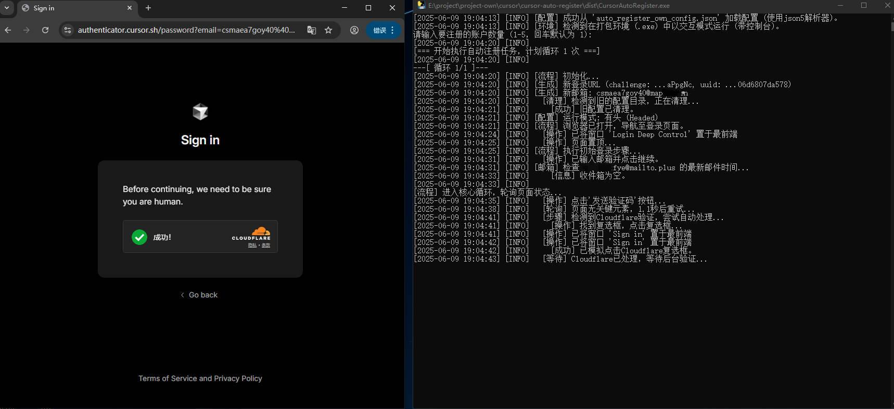

# Cursor 自动注册工具

这是一个高效、自动化的脚本，用于批量注册 Cursor 账户。它能处理从生成随机身份、通过 Cloudflare 人机验证到获取邮箱验证码的全过程，最终将成功的账户凭证保存到本地。

> **注意**：本工具目前仅支持 **Windows** 操作系统。

## ✨ 主要功能

- **🚀 全自动注册**: 一键启动，脚本自动完成所有注册步骤。
- **🛡️ 高级人机验证处理**: 为了稳定通过 Cloudflare Turnstile 人机验证，本工具默认以"有头模式"运行浏览器。

## 📸 效果演示

## ⚙️ 配置文件说明 (`auto_register_config.json`)

在使用前，请务必正确填写 `auto_register_config.json` 文件中的必要信息。

### 必填项

- `"RECEIVING_EMAIL"`: 用于接收验证码的临时邮箱地址。
  - **说明**: 程序会自动轮询此邮箱以获取验证码。
  - **获取地址**: 前往 [tempmail.plus](https://tempmail.plus) 获取免费的临时邮箱和对应的 PIN 码。
  - **示例**: `"xxxxxxxx@mailto.plus"`

- `"RECEIVING_EMAIL_PIN"`: 上述邮箱对应的 PIN 码。
  - **说明**: 用于程序自动登录临时邮箱并读取验证码邮件。

- `"EMAIL_DOMAIN"`: 用于生成随机注册邮箱的域名(yourdomain.com)。
  - **说明**: 程序会使用此域名生成随机邮箱（如 `random123@yourdomain.com`）进行注册。请使用您自己购买的域名。
  - **注意**: 二级域名（如 `sub.yourdomain.com`）可能被 Cursor 禁止注册。

### Cloudflare 邮箱路由配置

为了让 `EMAIL_DOMAIN` 收到的邮件能被 `RECEIVING_EMAIL` 接收，您需要配置 Cloudflare 的免费邮箱路由功能。

**配置教程**: [Bilibili - Cloudflare 邮箱转发服务配置教程](https://www.bilibili.com/opus/951275934028136469)

### 其他配置项 (通常无需修改)

- `"LOOP_COUNT"`: 默认单次注册账户的个数，默认为 `1`。
- `"MAX_LOOP_COUNT"`: 交互模式下允许用户输入的单次最大注册数，默认为 `5`。
- `"HEADLESS"`: 是否以无头模式运行，**已固定为 `false`，请勿修改**。
- `"LONG_WAIT"`, `"SHORT_WAIT"`, `"POLL_INTERVAL"`: 用于控制流程的各类超时和等待时间。
- `"ACCOUNT_FILE"`, `"NO_TOKEN_ACCOUNT_FILE"`: 保存成功和不完整账户信息的文件名。
- `"PROFILE_DIR_NAME"`: 存放浏览器临时配置文件的目录名。
- `"BASE_LOGIN_URL"`: Cursor 登录页面的 URL。

## 🚀 使用指南

### 与 YCursor 配合使用

本工具生成的账户文件 (`cursor_accounts.json`) 可直接导入 [YCursor 工具](https://docs.qq.com/aio/DV2VKUnNaeFRyRGRH?p=DKRZhtXI98ELAa724va8q8)，实现一键切换账户和重置Cursor Pro试用。

### 账户与 Token 说明

- **Token 获取限制**: Cursor 服务器对 IP 有请求限制，通常**每个 IP 每天只能成功获取 5 个账户的 Token**。
- **无 Token 账户处理**:
  - 当达到获取上限后，后续成功注册但未能获取到 accessToken 的账户，会保存在 `cursor_accounts_no_token.json` 文件中。
  - 您可以稍后使用这些账户的 `WorkosCursorSessionToken`，通过[网页工具](https://token.cursorpro.com.cn/)或 API 手动获取 `accessToken`。

### 💡 使用技巧

> 1.  切换账户前重置 Cursor，大概率可跑满 50 次试用额度。
> 2.  使用干净的 IP 地址并开启 TUN 代理模式，大概率可跑满 150 次试用额度。

## ⚠️ 免责声明

本项目仅供学习和技术交流之用，用户在使用本项目的过程中，应遵守相关法律法规。

作者不对任何用户因使用（或无法使用）本软件所造成的任何直接或间接的损失、损害或责任负责。

任何用户在下载、安装或使用本项目的任何部分时，即表示已完全理解并同意本免责声明。如果您不同意本声明的任何内容，请立即停止使用并删除所有相关文件。 
